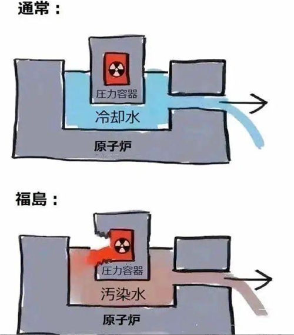

## 论文
1. [“新苏南模式”——地方政府公司化的一个缩影.pdf](/scholar/“新苏南模式”——地方政府公司化的一个缩影.pdf)
1. [中国农村社会结构变化背景下的乡村治理与农村发展.pdf](/scholar/中国农村社会结构变化背景下的乡村治理与农村发展.pdf)
1. [中国的城镇化与发展中国家城市化的教训.pdf](//scholar/中国的城镇化与发展中国家城市化的教训.pdf)
1. [全球资本化与制度性致贫.pdf](/scholar/全球资本化与制度性致贫.pdf)
1. [国家资本再分配与民间资本再积累.pdf](/scholar/国家资本再分配与民间资本再积累.pdf)
1. [户籍制度改革的历史、现状与未来.pdf](/scholar/户籍制度改革的历史、现状与未来.pdf)
1. [百年中国一波四折.pdf](/scholar/百年中国一波四折.pdf)


## 学习记录
```text

通胀的源头主要是贸易顺差，然而外汇储备只创造基础货币，泛滥的M2是通过信贷创造的

工业化,就一定是 资本增密 排斥劳动 的过程

经济繁荣→生产过剩→利润下降→产业空心化

资本增密 排斥劳动  成本转嫁理论


中国模式不可复制
1. 完整主权
1. 需要秦始皇  车同轨 书同文 行同伦 统一度量衡
1. 均田

工业化资本原始积累怎么来：
方式一： 对外  殖民
方式二： 对内  统购统销、农业集体化、户籍制度 ，工农业剪刀差—重工业优先发展 （国际大环境决定的）

原始积累一般来源于三种方式，
一是西方国家依靠对外殖民扩张完成工业化原始积累；
二是发展中国家以国家主权被干扰为代价，依赖外资完成工业化原始积累；
三是从农业、农村、农民（简称为三农）或资源环境提取剩余。
由于发展中国家不能像西方宗主国那样搞殖民化掠夺，就只能依赖后两种路径，总结起来便是：对内剥削 + 对外举债。

```

## 学习记录
```text
金融殖民 、现代地租 、脱实向虚

敢于斗争、善于斗争，坚持斗争


货币的背书是国家，当国家没有了，该国的货币将一文不值。

很多人喊要追求公平，其实内心深处并不想公平，只是痛恨自己为什么不是既得利益者

沉默的大多数工农联盟才是基本盘

经济基础决定上层建筑，上层建筑对经济基础有反作用。 上层建筑搞不定的代价，然后砸出政策调整（也就是改革）

```

## 学习记录
```text
医药市场化： 安全 无效 利润高 随便开 吃不死 吃不好  （不能研发一次就吃好的药，必须让其对药品有依赖）


医疗，教育，养老三座大山

超级地租 制造巨大的贫富差距  百姓被盘剥的 朝不保夕。此时只要外部势力稍微煽动，就产生动乱


如果我们不能给老百姓提供免费的医疗和教育，那革命是为了什么？ （不要忽略组织起来的力量）

资本需缺的时候，可以劳动替代资本

一个国家的覆灭,往往是从内部开始


攻击不了观点就攻击人搞臭弄黑  （污名化 、戴帽子、贴标签、搞扩大化）

任何激进的改革都会使利益向少数人集中，而代价是给了百姓


伪城市化就是没有产业支撑，全靠师医公的转移支付支撑

最大矛盾是发展区和优质农田分布区高度重合


资本的全球积累和剩余价值的获得不是通过商品生产来实现，而是通过资本主义国家和非资本主义国家之间的商品交换来实现的
人类历史上形成的部族、民族与国家，都不是孤立地演化与发展，而总是在相互联系中形成一定的“世界性体系”

萨米尔·阿明的依附论和世界体系理论也主张：1.“中心与边缘”是世界体系的基本结构。2.“中心和边缘的关系本质上是经济的”

沃勒斯坦的世界的结构体系分为三个层次：核心（core）、半周边（semi-periphery）和周边（periphery）。

```

## 学习记录
```text

慧见｜“不信邪”温铁军：乡村振兴是应对内忧外患的压舱石

https://m.21jingji.com/article/20210917/herald/02c36257eb1180de3c1c42092eaca5a8.html

成本转嫁论

如何看待温铁军？为什么他并不是很火呢？(温铁军小圈子里面真正火的,根本不是农业问题,而是殖民地的原始积累、全球金融危机)

因为人地关系紧张导致的劳动力过剩，以及城乡分割二元结构导致城市化大大滞后于工业化的问题，如果国家不采取有效政策发展劳动密集型产业，减轻土地上的人口压力，小农有可能破产，农业会随之衰落。

经济繁荣→生产过剩→利润下降→产业空心化”的经济规律
资本流出实体产业造成工人失业,穷人变穷,资本追逐利润流入金融行业,富人越来越富,两极分化的结果一定是社会的不安定。

工业化  工业化是一个资本增密的过程
https://www.zhihu.com/question/50116816


危机不分城市农村，可是工资分城市农村啊，农村人种一年地和城市人打一年工，谁的钱多谁的钱少，大家的心里明镜一样。


公粮，三提五统，出义务工，各种摊派

现实最能教育人

```


## 学习记录
```text
论如何利用马克思主义把工人阶级打成反动派的

原文： https://weibo.com/1687813073/MDcFQpdYb

在资本主义社会，人类是他们购买商品的延伸，而商品是人的思想和身体的延伸，大众受到了技术控制，在大规模生产和消费的社会中，个体工人成为了商品和商品化生活方式的消费者。

消费主义的压力导致工人阶级完全融入资本主义体系，其政党和工会完全官僚化

由于压制性技术的存在，工人不会质疑他们的生活方式，技术的使用导致工人无法意识到周围发生的事情，工人不再像卡尔马克思时代那么叛逆，他们只是为了满足他们的需求和生存遵守制度，由于工人不再叛逆，变得循规蹈矩了，因此工人阶级不再是能够带来革命的变革力量，反而由于融入资本主义，成了绊脚石。

那么新的革命力量在哪里呢？在激进知识分子，社会化边缘群体，外来者的底层，其他种族等，由于这些人的生存条件比较差，他们会要求结束现有的制度，他们的反叛将会是革命性的。

激进知识分子，
社会化边缘群体，
外来者的底层，
其他种族


你会看到 中产 给三座大山 加土

```

## 学习记录 2023-08-20
```text
八次危机

在“城乡二元结构”的基本体制的“土地均分制”的基本财产关系下，乡村中内在形成的“农户理性”和“村社理性”得以内部化外部环境风险，
使得数以亿计的农民工得以聚落于村社的家庭为单位，既以非市场化的平均分配得到的无风险资产土地来承担“非农就业”的风险，
又在无形之中，拱手把风险收益让渡给了企业家和发达地区的政府

因此，农民事实上是由于自己手中的那一份土地可以耕作而实现的风险转嫁，由于土地的非市场性质，无论中国事实上危机如何，农民工们都可以返回自己的土地而不至于发生西方国家危机时刻飙高的失业率

所以千万人失业，暂不会出现 游行动荡


```

## 学习记录 2023-08-21
```text

商业地产垄断，租金年年涨  导致物价高涨 ,一地鸡毛 ，消费力减少，订单减少，经济重新下滑

```


## 学习记录 2023-08-24
```text

美元如何收割全世界： 美元充裕的时候放贷给其他国家发展（降息，0利率），发展差不多了美元就加息回流，别的国家就会缺美元还不起钱，被迫贱卖优质资产还钱

```

## 学习记录 2023-08-26
```text

一刀切，扩大化，极端态

反串黑，极端化，扩大化

```

## 学习记录 2023-08-27
```text

假扮麻匪

反串黑，极端化，扩大化

远程养殖技术果然厉害


```

## 学习记录 2023-08-27
```text
核废水 与 核污水的区别

日本核污水排海有哪些严重后果？https://www.ixigua.com/7270814307481616954


```



## 学习记录 2023-08-29
```text

怎么样维持房价不跌，一直涨

把教育、医疗资源集中起来 （使用这些资源的前提，对不起先买房）

加快搞合村并居，低价收宅基地，抵押土地，债务展期 。

```

## 学习记录 2023-08-30
```text

金融资本 人为制造能源危机、粮食危机，水危机 达到控制、收割全球

```

## 学习记录 2023-09-01
```text

金融机构不愿意牺牲既得利益成为阻碍经济良性运转的问题

```

# 学习记录 2023-09-02
```text

用最无辜的眼神，说最狠的话，办最解气的事！
https://www.ixigua.com/7267090432448791100

```
# 学习记录 2023-09-05
```text

温铁军：合村并居的背后意味着什么？
https://www.toutiao.com/article/6831338131476709895/


https://zhuanlan.zhihu.com/p/145638813


温老师自述：乡建思想理论体系 - 北京大学 Peking University
1.中华乃至人类文明的传承，不是简单的人为造成，而是根据不同环境而逐步形成的。
2.制度派生论。
3.成本转嫁论。
4.发展中国家的主权外部性。(反殖民未未完成） 跌入发展陷阱
5.乡土社会的内部化作用。

https://www.youtube.com/watch?v=f84ctIws98M

```

##
```text

既要关心自己,也要关心大环境 ！

夺回金融主权，摆脱金融殖民  （金融殖民不仅对外,也对内）。

更多金融殖民信息： https://www.baidu.com/s?ie=utf-8&wd=%E9%87%91%E8%9E%8D%E6%AE%96%E6%B0%91%E4%B8%BB%E4%B9%89


可以观察香港的超级地租，同时你还会发现，一部分中产群体主动给三座大山加土。


多观察，多看看。


[金融资本无国界，金融资本洗劫全世界](http://www.snzg.cn/article/2015/0812/article_41245.html)

金融资本 人为制造能源危机、粮食危机，水危机 达到控制、收割全球


收益率超过10%就已经要做好血本无归的准备  郭树清


什么是财政转移支付？有怎样的作用？
https://www.zhihu.com/question/29004568/answer/2509786243
转移支付是缓解“税源背离”的。
财政转移支付对应于财政支出得第一张表：“一般公共预算支出”。  大部分用于给体制内发薪资福利待遇


国家资本的积累来源是哪里？生产剩余价值最后落在谁手里？


温铁军：有些科学家实质是资本家 http://www.wyzxwk.com/Article/sannong/2020/06/420054.html

科学、医疗、教育等领域都有“信息单方垄断”的特点，只要在市场条件下都会使信息垄断者单方占有垄断利益。这是弱势群体看不起病、上不起学、付不起科技费用的内因。


https://www.toutiao.com/article/7275363233714848267/
知识生产应该自觉地服务于国家需求；
我们仍处在“居危思危”阶段；
中国思想理论界还未摆脱西方话语体系；
我们不能走向错误的道路。

```

# 学习记录 2023-12-12
```text


由于诸多方面原因，缺乏相关知识也没有能力通过周边广泛获取客观资料，从而不能在诸多信息的比较中产生分析的结果。
特性就是见识少易被煽动，一股脑激情，初衷大部分是好的，但是分不清好坏。


```

```text

资本过剩，产能过剩，劳动力过剩 恶性循环

资本过剩: 产业资本、金融资本、商业资本都过剩
```
```text
逃废债

本有限责任公司因经营不善，公司破产，财务负资产。

https://weibo.com/1231668867/NwM3o8MHz

```
